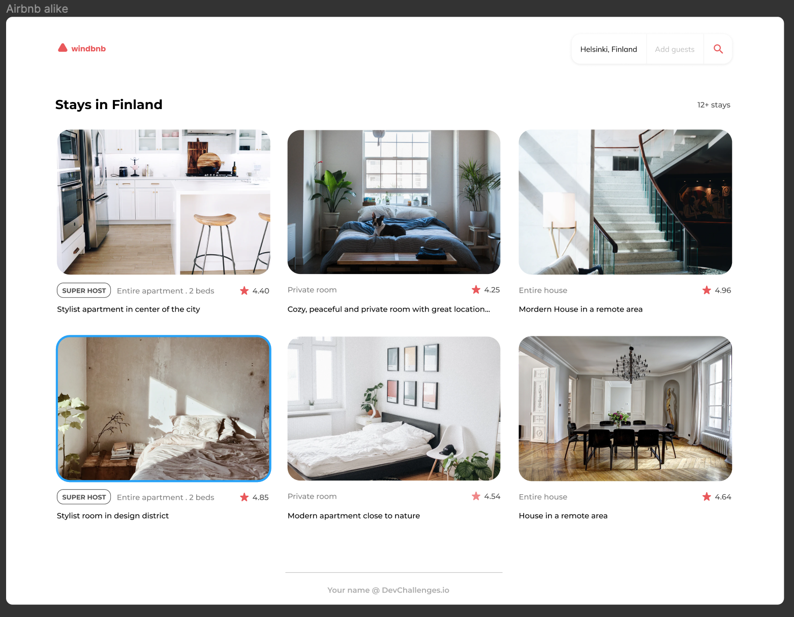

# WindBNB

Challenge: Create a small version of Airbnb - Windbnb with given data, and use React to handle the frontend. Don’t look at the existing solution. Fulfill user stories below:

-   User story: I can see a list of properties
-   User story: I can see property card with a name, rating, apartment type, and super host
-   User story: I can open filter drawer
-   User story: I can filter properties by location and number of guests
-   User story: I can see the number of filtered items
-   User story: I can see pages following given designs

Icon: https://google.github.io/material-design-icons/

[Check the design link here](https://www.figma.com/file/KGNH8dbclXT1vzXLyPrBeu)

As long as you fulfill all the user stories, you can give your personal touches by adding transition, using your own images, changing colors, or even creating your own layout,...

Once you completed, submit your solutions by providing URLs for both GitHub repository and live app on Netlify and explain briefly what you have done.

Good luck everybody!
